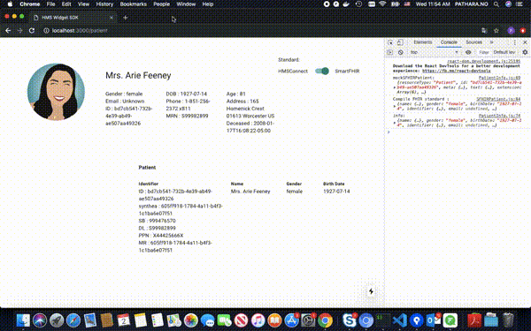

<h2 style="text-align:center"><strong>HMS Widget SDK</strong></h2>
<span style="text-align:center"><strong>HMS Widget SDK</strong> is healthcare widget provider. We are a part of HMS Software Development Toolkit (HMS-SDK) will be a collection of tools that enable the efficient development of "add-on" applications. 
GLS will host workshops to provide training on the proper use of the HMS-SDK. 
The HMS-SDK fill facilitate writing both local add-on applications and enterprise applications.</span>

## **Installation**

We required dependencies below:

 - [NodeJS](https://nodejs.org/en/download/)
 - [Docker](https://docs.docker.com/install/)
 - [Docker Compose](https://docs.docker.com/compose/install/)
 - [NextJS](https://nextjs.org/docs)
 - [Material-UI](https://material-ui.com/)

## **Usage**

### **Step 1 : Create custom external Docker network**

We declare the network name to `iassdk`, you can create the network via command below:

```bash
$ docker network create iassdk
```

### **Step 2 : Start Docker compose with specific environment**

**Development environment**

```bash
# Stop current/previous service in docker compose file "docker-compose.dev.yml"
$ docker-compose -f docker-compose.dev.yml down -v

# Start service in docker compose file "docker-compose.dev.yml"
$ docker-compose -f docker-compose.dev.yml up --build -d
```

**Production environment**

```bash
# Stop current/previous service in docker compose file "docker-compose.prod.yml"
$ docker-compose -f docker-compose.prod.yml down -v

# Start service in docker compose file "docker-compose.prod.yml"
$ docker-compose -f docker-compose.prod.yml up --build -d
```

### **Alternative step**

Just run

```bash
# Development environment (calling "docker-compose.dev.yml")
$ sh run.sh dev

# Or 

# Production environment (calling "docker-compose.prod.yml")
$ sh run.sh prod
```

**Note** : You can check running log via command:
```bash
$ docker-compose -f docker-compose.dev.yml logs
```

### **Final step**

Enjoy with sample widget!

**note**:port number `3000` is development environment

```http
http://localhost:3000/patient
```

## **Information**

Our widget support multi-healthcare data standards in one component. Currently, we support :

 - `Smart FHIR` standard
 - `HMSConnect` standard

### **Data Schema**

We plan to use only one data schema to be main standard. But for now, `SmartFHIR` and `HMSConnect` have different data schema, please refer to example data below:

**SmartFHIR**

```json
{
    "resourceType": "Patient",
    "id": "bd7cb541-732b-4e39-ab49-ae507aa49326",
    "meta": {
        "versionId": "1",
        "lastUpdated": "2018-05-07T13:09:34.014-04:00",
        "tag": [
            {
                "system": "https://smarthealthit.org/tags",
                "code": "synthea-8-2017"
            }
        ]
    },
    "text": {
        "status": "generated",
        "div": "<div xmlns=\"http://www.w3.org/1999/xhtml\">Generated by <a href=\"https://github.com/synthetichealth/synthea\">Synthea</a>. Version identifier: 1a8d765a5375bf72f3b7a92001940d05a6f21189</div>"
    },
    "extension": [
        {
            "url": "http://hl7.org/fhir/us/core/StructureDefinition/us-core-race",
            "valueCodeableConcept": {
                "coding": [
                    {
                        "system": "http://hl7.org/fhir/v3/Race",
                        "code": "2106-3",
                        "display": "White"
                    }
                ],
                "text": "race"
            }
        },
        {
            "url": "http://hl7.org/fhir/us/core/StructureDefinition/us-core-ethnicity",
            "valueCodeableConcept": {
                "coding": [
                    {
                        "system": "http://hl7.org/fhir/v3/Ethnicity",
                        "code": "2186-5",
                        "display": "Nonhispanic"
                    }
                ],
                "text": "ethnicity"
            }
        },
        {
            "url": "http://hl7.org/fhir/StructureDefinition/birthPlace",
            "valueAddress": {
                "city": "Bridgewater",
                "state": "MA",
                "country": "US"
            }
        },
        {
            "url": "http://hl7.org/fhir/StructureDefinition/patient-mothersMaidenName",
            "valueString": "Sona Krajcik"
        },
        {
            "url": "http://hl7.org/fhir/us/core/StructureDefinition/us-core-birthsex",
            "valueCode": "F"
        },
        {
            "url": "http://hl7.org/fhir/StructureDefinition/patient-interpreterRequired",
            "valueBoolean": false
        }
    ],
    "identifier": [
        {
            "system": "https://github.com/synthetichealth/synthea",
            "value": "605ff918-1784-4a11-b4f3-1c1ba6e07f51"
        },
        {
            "type": {
                "coding": [
                    {
                        "system": "http://hl7.org/fhir/identifier-type",
                        "code": "SB"
                    }
                ]
            },
            "system": "http://hl7.org/fhir/sid/us-ssn",
            "value": "999476570"
        },
        {
            "type": {
                "coding": [
                    {
                        "system": "http://hl7.org/fhir/v2/0203",
                        "code": "DL"
                    }
                ]
            },
            "system": "urn:oid:2.16.840.1.113883.4.3.25",
            "value": "S99982899"
        },
        {
            "type": {
                "coding": [
                    {
                        "system": "http://hl7.org/fhir/v2/0203",
                        "code": "PPN"
                    }
                ]
            },
            "value": "X44425666X"
        },
        {
            "type": {
                "coding": [
                    {
                        "system": "http://hl7.org/fhir/v2/0203",
                        "code": "MR"
                    }
                ]
            },
            "system": "http://hospital.smarthealthit.org",
            "value": "605ff918-1784-4a11-b4f3-1c1ba6e07f51"
        }
    ],
    "name": [
        {
            "use": "official",
            "family": [
                "Feeney"
            ],
            "given": [
                "Arie"
            ],
            "prefix": [
                "Mrs."
            ]
        },
        {
            "use": "maiden",
            "family": [
                "Schneider"
            ],
            "given": [
                "Arie"
            ]
        }
    ],
    "telecom": [
        {
            "system": "phone",
            "value": "1-851-256-2372 x811",
            "use": "home"
        }
    ],
    "gender": "female",
    "birthDate": "1927-07-14",
    "deceasedDateTime": "2008-01-17T16:08:22-05:00",
    "address": [
        {
            "extension": [
                {
                    "url": "http://hl7.org/fhir/StructureDefinition/geolocation",
                    "extension": [
                        {
                            "url": "latitude",
                            "valueDecimal": 42.21690245266151
                        },
                        {
                            "url": "longitude",
                            "valueDecimal": -71.79490155461701
                        }
                    ]
                }
            ],
            "line": [
                "165 Homenick Crest"
            ],
            "city": "Worcester",
            "state": "MA",
            "postalCode": "01613",
            "country": "US"
        }
    ],
    "maritalStatus": {
        "coding": [
            {
                "system": "http://hl7.org/fhir/v3/MaritalStatus",
                "code": "M"
            }
        ],
        "text": "M"
    },
    "multipleBirthBoolean": false,
    "communication": [
        {
            "language": {
                "coding": [
                    {
                        "system": "http://hl7.org/fhir/ValueSet/languages",
                        "code": "en-US",
                        "display": "English (United States)"
                    }
                ]
            }
        }
    ]
}
```

**HMSConnect**

```json
{
    "resourceType": "Patient",
    "hn": "15-99-999999",
    "identifier": [
        {
            "type": "MRN",
            "value": "15-99-999999",
            "start": "2013-09-30T21:29:04",
            "end": ""
        },
        {
            "type": "NID",
            "value": "3219999999999",
            "start": "2013-09-30T00:00:00",
            "end": "2020-09-18T00:00:00"
        }
    ],
    "active": true,
    "name": [
        {
            "text": "นาง มานะ มานี",
            "prefix": "นาง",
            "givenName": "มานะ",
            "middleName": "",
            "familyName": "มานี",
            "language": "TH"
        },
        {
            "text": "miss mana manee",
            "prefix": "miss",
            "givenName": "mana",
            "middleName": "",
            "familyName": "manee",
            "language": "EN"
        }
    ],
    "telecom": [
        {
            "type": "mobile",
            "value": "0899999999"
        }
    ],
    "gender": "female",
    "birthDate": "1967-08-15",
    "deceasedBoolean": false,
    "deceasedDateTime": "",
    "address": [
        {
            "text": "9999/9   ถ.ราษฎร์บำรุง เนินพระ เมืองระยอง ระยอง 21000",
            "line": "9999/9   ถ.ราษฎร์บำรุง",
            "city": "เนินพระ",
            "district": "เมืองระยอง",
            "state": "ระยอง",
            "postalCode": "21000",
            "country": "THA"
        }
    ],
    "maritalStatus": "single",
    "nationality": "TH",
    "religion": "พุทธ (BUDDHISM)",
    "contact": [
        {
            "relationship": "",
            "type": "",
            "value": ""
        }
    ],
    "communication": [
        {
            "language": "TH",
            "preferred": true
        }
    ],
    "vip": {
        "type": "",
        "display": ""
    },
    "organization": {
        "codeNumber": "015",
        "codeName": "BRH",
        "name": "Bangkok Hospital Rayong",
        "latitude": "",
        "longitude": ""
    }
}
```

**`** OUR PLAN **`** : 
Our widget will detect data standard from an attribute `hn` in data schema. 

Example: If it found the attribute in data schema, it will select sub-components which are support `HMSConnect` standard and render the data on it.

### **Data flow of our widget**


**note** : select component for the standard at step#3 

## **Limitation**

Now our data does not have any attribute to classify data standard from data source yet. So, in this example using toggle button to switch data source instead <font color="red">(for now, the data source is mock data because `HMSConnect` standard didn't provide endpoint to access fake data service or sandbox service yet)</font>.

## License

MIT License