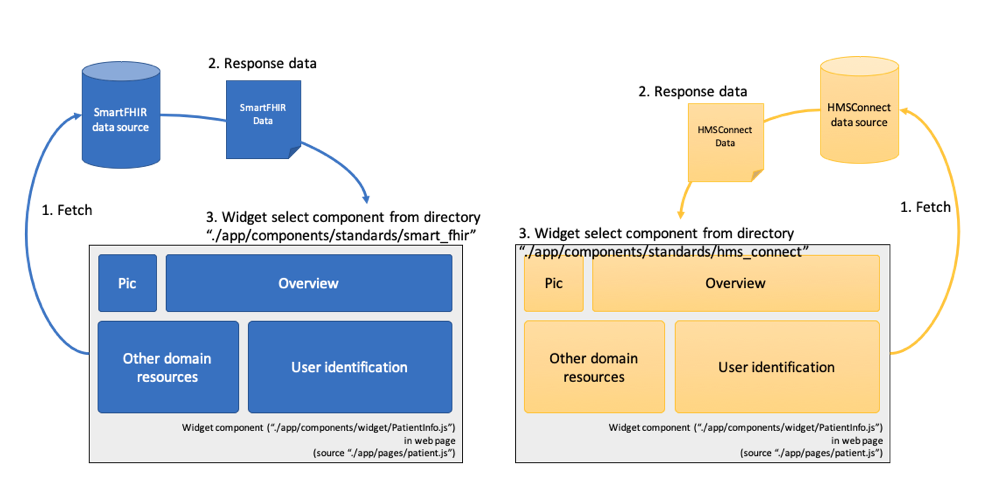

# **HMS Widget SDK**


<span style="text-align:center"><strong>HMS Widget SDK</strong> is healthcare widget provider. We are a part of HMS Software Development Toolkit (HMS-SDK) will be a collection of tools that enable the efficient development of "add-on" applications. 
GLS will host workshops to provide training on the proper use of the HMS-SDK. 
The HMS-SDK fill facilitate writing both local add-on applications and enterprise applications.</span>

## **Installation**

We required dependencies below:

 - [NodeJS](https://nodejs.org/en/download/)
 - [Docker](https://docs.docker.com/install/)
 - [Docker Compose](https://docs.docker.com/compose/install/)
 - [NextJS](https://nextjs.org/docs)
 - [Material-UI](https://material-ui.com/)

## **Usage**

### **Step 1 : Create custom external Docker network**

We declare default network name `iassdk` to communicate between service in Docker compose, you can create the network via command below:

```bash
$ docker network create iassdk
```

### **Step 2 : Start Docker compose with specific environment**

**Development environment**

```bash
# Stop current/previous service in docker compose file "docker-compose.dev.yml"
$ docker-compose -f docker-compose.dev.yml down -v

# Start service in docker compose file "docker-compose.dev.yml"
$ docker-compose -f docker-compose.dev.yml up --build -d
```

**Production environment**

```bash
# Stop current/previous service in docker compose file "docker-compose.prod.yml"
$ docker-compose -f docker-compose.prod.yml down -v

# Start service in docker compose file "docker-compose.prod.yml"
$ docker-compose -f docker-compose.prod.yml up --build -d
```

### **Alternative step**

Just run

```bash
# Development environment (calling "docker-compose.dev.yml")
$ sh run.sh dev

# Or 

# Production environment (calling "docker-compose.prod.yml")
$ sh run.sh prod
```

**Note** : You can check running log via command:
```bash
$ docker-compose -f docker-compose.dev.yml logs
```

### **Final step**

Enjoy with sample widget!

**note**:port number `3000` is development environment

```http
http://localhost:3000/patient
```

## **Information**

Our widget support multi-healthcare data standards in one component. Currently, we support :

 - `SmartFHIR` standard
 - `HMSConnect` standard

### **Data Schema**

We plan to use only one data schema to be main standard. But for now, `SmartFHIR` and `HMSConnect` have different data schema, please refer to example data below:

**Schema**

 - SmartFHIR : [see more detail](https://github.com/HMSConnect/hms-widget-sdk/blob/master/fake/mock/standards/smart_fhir/patient.js)
 - HMSConnect : [see more detail](https://github.com/HMSConnect/hms-widget-sdk/blob/master/fake/mock/standards/hms_connect/patient.json)

Our widget (HMSConnect standard) will detect data standard from an attribute `hn` in data schema. 

Example: If it found the attribute in data schema, it will select sub-components which are support `HMSConnect` standard and render the data on it.

### **Data flow of our widget**

**Workflow**

1. Main component (widget)
2. Load data from any source
3. Check response data is valid to which standard
4. Compile data with the standard

**Pseudo code** 

```jsx
// Ex. Main component (widget)

// Standard object
import SFHIRPatient from '/some_where1.js';
import HMSPatient from '/some_where2.js';
// Component of each statndard
import SFHIRPatientInfoTable from '/some_where3.js';
import HMSPatientInfoTable from '/some_where4.js';

const HMSPatientObj = new HMSPatient();
const SFHIRPatientObj = new SFHIRPatient();

// ...

export default class Widget extends React.Component {

    constructor(props) {
        // ...

        this.state = {
            patient:null,
            isSFHIRStandard:true
        }
    }

    // ...

    componentDidMount(){
        this.callingAPI(sanboxEndpoint, 'GET', data,
            function(data) {
                let isSFHIRStandard = false;
                if(HMSPatientObj.isValid(data)) {
                    HMSPatientObj.setData(data);
                    info = HMSPatientObj.compile();
                    isSFHIRStandard = false;
                } else if(SFHIRPatientObj.isValid(data)) {
                    SFHIRPatientObj.setData(data);
                    info = SFHIRPatientObj.compile();
                    isSFHIRStandard = true;
                } else {
                    alert('Sorry, we are not support current data standard!')
                }
                    
                if(info) {
                    this.setState({ 
                        patient:info,
                        isSFHIRStandard:isSFHIRStandard
                    });
                }
            }
        );
    }

    // ...

    render(){
        const { patient, isSFHIRStandard } = this.state;
        return (
            <div>
            {
                isSFHIRStandard
                ? <SFHIRPatientInfoTable info={patient} />
                : <HMSPatientInfoTable info={patient} />
            }
            </div>
        )
    }
}
```



**note** : data standard classification is in step#3.

## **Services in Docker compose**

### **1. Fake data service**

### ___1.1. HMSConnect___

   We are not allow any user to access our resources directly, it is user's privacy issue. So we provided micro-service to serve mock HMSConnect data standard via port number `3002`. In source code, you just set your target endpoint of API to :

```javascript
// Ex. your_widget.js
    // ...
    sanboxEndpoint = `${process.env.HMS_SANDBOX_URL}${process.env.HMS_SANDBOX_PORT}/patient`;
    // ...
```

In `.env.[YOUR_ENVIRONMENT]`:

```
HMS_SANDBOX_PORT=:3002
HMS_SANDBOX_URL=http://localhost
```

For the other example domain resources except `patient`, we provide :
 - [allergy](https://github.com/HMSConnect/hms-widget-sdk/blob/master/fake/mock/standards/hms_connect/allergy.json)
 - [condition](https://github.com/HMSConnect/hms-widget-sdk/blob/master/fake/mock/standards/hms_connect/condition.json)
 - [encounter](https://github.com/HMSConnect/hms-widget-sdk/blob/master/fake/mock/standards/hms_connect/encounter.json)
 - [practitioner](https://github.com/HMSConnect/hms-widget-sdk/blob/master/fake/mock/standards/hms_connect/practitioner.json)
 - [procedure](https://github.com/HMSConnect/hms-widget-sdk/blob/master/fake/mock/standards/hms_connect/procedure.json)

 In your widget, you can change endpoint from `patient` to be keyword above in `lowercase` string :

```javascript
// Ex. your_widget.js
    
    // Change from
    sanboxEndpoint = `${process.env.HMS_SANDBOX_URL}${process.env.HMS_SANDBOX_PORT}/patient`;
    
    // Change to
    sanboxEndpoint = `${process.env.HMS_SANDBOX_URL}${process.env.HMS_SANDBOX_PORT}/encounter`;
```

### ___1.2. SmartFHIR___

They have already provided sandbox in their website. You can access via `https://[FHIR_VERSION].smarthealthit.org/Patient/[MOCK_DATA_WITH_USER_ID]`. We suggest you to find user's ID from link below to use in your development environment:

```bash
# Ex. List of patient of FHIR version 2 (R2 or DSTU2)
https://patient-browser.smarthealthit.org/index.html?config=r2#/
```

In source code, you just call via example endpoint below:

```javascript
// Ex. your_widget.js
    // ...
    sanboxEndpoint = 'https://r2.smarthealthit.org/Patient/bd7cb541-732b-4e39-ab49-ae507aa49326';
    // ...
```

**IMPORTANT** :

Please be aware FHIR version, they provide FHIR many version :
 - R2 (DSTU2)
 - R3 (STU3)
 - R4 (STU3)

Your component should be classified FHIR version correctly.

For more detail : please refer to https://dev.smarthealthit.org/

### **2. Sample application with widget component**

## **Contribution**

Clone or fork our source via [Github](https://github.com/HMSConnect/hms-widget-sdk)

## License

MIT License