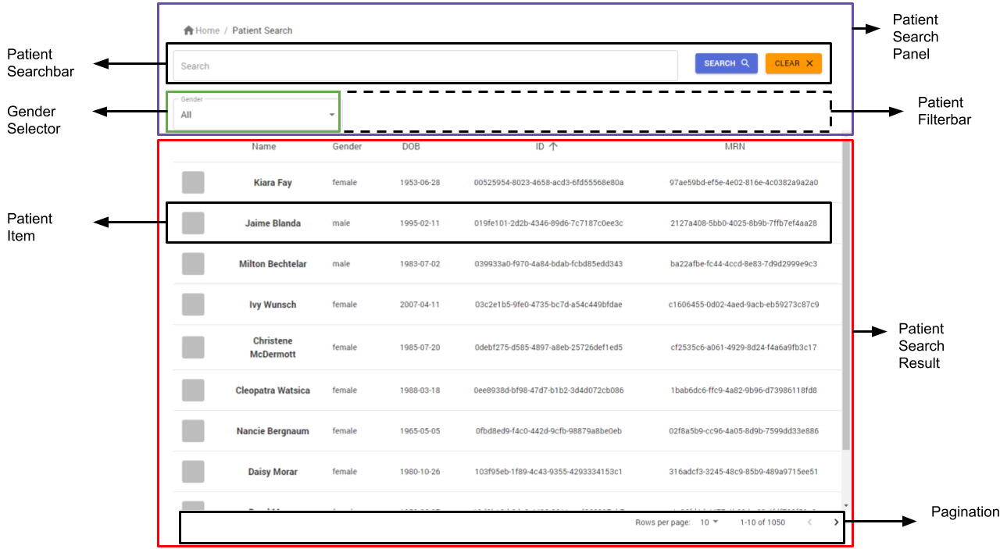
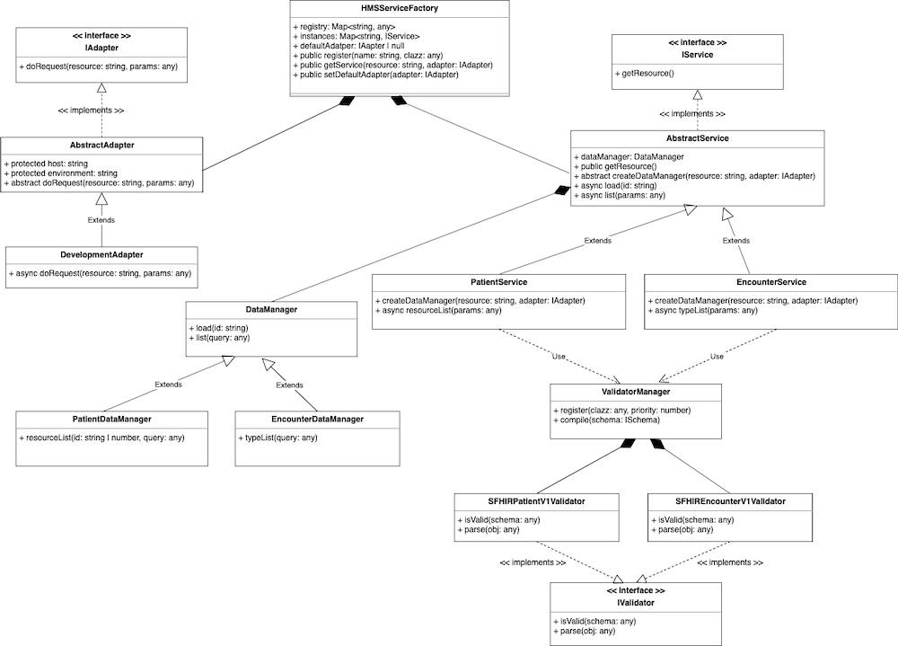

**Patient Search Result Release**

In sprint 1, the main objective is to create the Patient Search Widget that can search by name, last name, identification (MR) and gender.

## Client Widget Component


Overview
In sprint 1, form client side there are two widgets that we have progress
1. Patient Search Widget is the widget that we will release in this sprint
2. Patient Info Widget is the widget that we will release it next sprint and we have a little progress in this widget

Description of widget

1. Patient Search Widget



Component | Type | Feature
-- | -- | --
Gender Selector | widget | This widget using for filters patient by gender, which can filter by three types, Male, Female, and any gender
Patient Search | widget | This widget represents the list of patients data, which can search by name, last name, identification’s data, or gender. There are three components that are wrapped, Patient Search Panel, Patient Search Result, and Pagination
Patient Search Panel | template | This template is a group of components that use for search patients, which include two components, Patient Filter Bar and Patient Search Bar
Patient Filter Bar | template | Patient Filter Bar use to filter by Dropdown component, now we have one component is Gender Selector
Patient Search Bar | template | Patient Search Bar use to search by name, last name or identification (Passport, MRN, HN)
Patient Search Result | template | This template represents the list of patients, which include one component is Patient Item. This template can sort information of patient by given name, gender, birthdate, ID, and MR
Patient Item | template | This component using for show information of a patient also including onClick event that navigates to Patient Info widget
Pagination | base | This base component is to handle paginate function of the list of data

2. Patient Info Widget


Component | Type | Feature
-- | -- | --
Patient Info | widget | This widget represents the information of patient, which include three components, Patient Panel, Patient Sidemenu, and Patient Table
Patient Panel | template | This template using for show picture and overview of patient information
Patient Sidemenu | template | This template using for select the information that the user wants to see
Patient Table | template | This template represents the patient information that is selected by Patient Sidemenu


## Client Integration Middleware



Class | Description
-- | --
HmsService | Provide many services, in this sprint the PatientService is available.
PatientService | This service can use get and list from PatientDataAdapter.use get for request Patient from iduse the list for request Patient list and use PaginationOption is parameter include offset, max, page, sort, and filter.
PatientDataAdapter | Use requests to the server from selecting the DataAdapter's environment.
DataAdapter | Request to resource able to support multi-environment.
Patient | Provide for selecting parse resource following schema from SFHIRPatient.
SFHIRPatient | Validate and compile following from schema and version.


## Fake API/Mock API

All structures that have been updated, as shown below.
```
|-- fake
|   |-- server.js
|   |-- storage.js
|   |-- apis
|   |   |-- v1
|   |   |   |-- patient.js
|   |-- services
|   |   |-- patient.js
|   |   |-- utils
|   |   |   |-- index.js
```
we have 4 topics for updates.
* Router use request API for patient, we change location to `fake/apis/v1/patient.js`
    - selector  → the feature Selector for query in the Mini-Mongo from query-string 
    - options → the feature for create Options for sort from query-string.
* Mock metadata we update function `processingPredata` in file `storage.js` 
    - pre-data → pre-process data use for query the mini-mongo that restructure data to the object `__mock_data`.
    - post-data →  post-process data for excluding the object `__mock_data` when complete the process query resource from the mini-mongo.
```javascript
exports.createPaginate = (results, paginationOption) => {
  ....
  return {
    schema: { version: 1.0, standard: 'SFHIR' },
    results: results.slice(offset, offset + max),
    totalCount: results.length
  }
}
```
* Schema 
 We provide schema is version and standard for compile SFHIRPatient standard.
    - version -- for filter each structure standard resource.
    - standard -- for show type standard insist of SFHIR, HMS Standard.
* Paginate
We provide totalCount and results for Paginate that Object passing filters through the query-string.