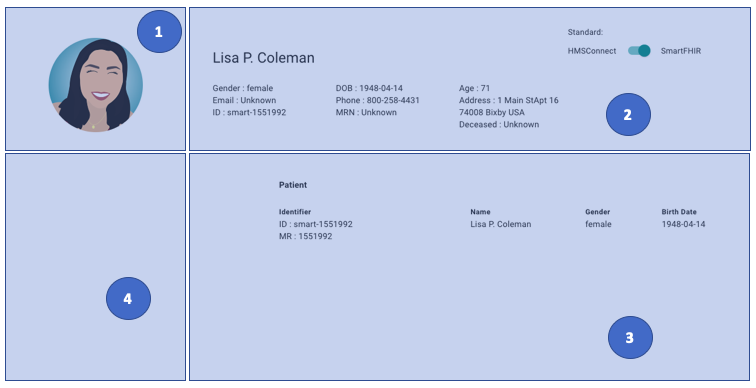

# **Sample widget**

For `<PatientInfo/>` in previous session or our sample `widget` has 4-components inside it, including :



?> **note** : any component below used component's style of `Material-UI`

**1. Avatar area**

This component using for shows user picture.

```js
    <Grid item xs={12} sm={3}>
        <Avatar 
            alt="Remy Sharp" 
            src="../../static/images/mock-person-profile.png" 
            className={classes.bigAvatar} />
    </Grid>
```

**2. Info panel area**

We plan to show overview user/patient info in info panel area.

```js
    <Grid container spacing={3}>
    {
        this.state.isSFHIRStandard
        ? <SFHIRPatientInfoPanel info={patient}/>
        : <HMSPatientInfoPanel info={patient}/>
    }
    </Grid>
```

?> **note** : for this area, we prepare to modify component's style of both components(`SFHIRPatientInfoPanel` and `HMSPatientInfoPanel`) and support both data standards(`SmartFHIR` and `HMSConnect`). Layout/Content in the component can be different, so we will check data schema first before rendering data in "info panel area".

At the top-right corner of the screen, we provide trigger to switch data source between SmartFHIR and HMSConnect. It makes developer easy to check relation between data schema and component. But we will not adding the feature in real use.

```js
    <Grid container spacing={3}>
        <Typography component="div">
        <small>Standard:</small>
        <Grid component="label" container alignItems="center" spacing={1}>
            <Grid item><small>HMSConnect</small></Grid>
            <Grid item>
            <Switch 
                name='isSFHIRStandard'
                checked={isSFHIRStandard} 
                onChange={(e) => this.handleSwitchChange(e)} 
                value="smart_fhir" />
            </Grid>
            <Grid item><small>SmartFHIR</small></Grid>
        </Grid>
        </Typography>
    </Grid>
```

**3. Info table area**

Info table using for show detail of user/patient info.

```js
    <Grid item xs={12} sm={8}>
    {
        this.state.isSFHIRStandard
        ? <SFHIRPatientInfoTable info={patient} />
        : <HMSPatientInfoTable info={patient} />
    }
    </Grid>
```

?> **note** : for this area, we prepare to modify component's style of both components(`SFHIRPatientInfoTable` and `HMSPatientInfoTable`) and support both data standards(`SmartFHIR` and `HMSConnect`). Layout/Content in the component can be different, so we will check data schema first before rendering data in "info table area".

**4. Domain resource list area**

We prepare to add domain resource list. For now, the area has nothing.

```js
    <Grid item xs={12} sm={4}></Grid>
```